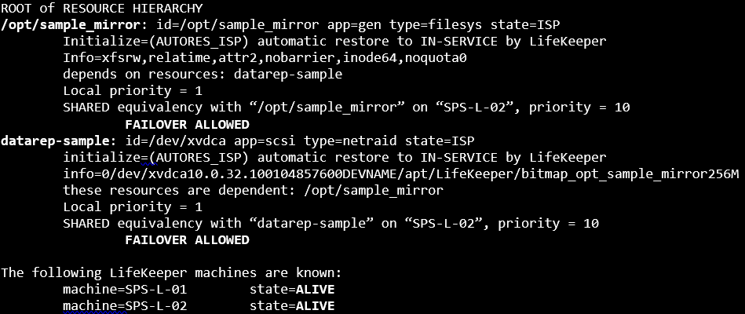

// Add steps as necessary for accessing the software, post-configuration, and testing. Don’t include full usage instructions for your software, but add links to your product documentation for that information.
//Should any sections not be applicable, remove them

== Test the deployment

To test the deployment, check that the full stack has been created successfully and
that the `lcdstatus` command reports that failover is allowed for all resources.

. Open the https://console.aws.amazon.com/cloudformation[AWS CloudFormation console].
. Select the correct Region from the top toolbar.
. On the *Stacks* page, look for a status of `CREATE FAILED`. 
. Choose the stack name.
. On the *Stack details* page, choose the *Events* tab. Find the explanation for the failed status in the *Status reason* column.
. Fix errors with the stack. For more information, see link:#troubleshooting[Troubleshooting], later in this guide.
. After all stacks have a status of `CREATE COMPLETE`, open the https://console.aws.amazon.com/ec2/v2/home?region=us-east-1[Amazon EC2 console].
. Log in to either the bastion host or the optional Windows jump server. Follow the https://docs.aws.amazon.com/AWSEC2/latest/UserGuide/EC2_GetStarted.html#ec2-connect-to-instance-linux[AWS guidelines] for connecting to your instances.
. From the jump server node, use SSH (Secure Shell) to connect to the instance in the first Availability Zone.
. Run `sudo /opt/LifeKeeper/bin/lcdstatus`.
. The output should contain two resources: `/opt/sample_mirror` and `datarep-sample`. Both resources should report `FAILOVER ALLOWED`. Two known machines should be listed and reported as `ALIVE`.

[#test]
.Output of lcdstatus

For more information, see http://docs.us.sios.com/Linux/9.2.2/LK4L/AllTechDocs/index.htm[SIOS Technical Documentation].

== Best Practices

=== AWS services
SIOS recommends following AWS best practices for creating and using IAM roles and policies, IAM user credentials and roles, and access key rotation. For more information, see the following links.

* https://docs.aws.amazon.com/IAM/latest/UserGuide/id_roles_create_forservice.html[What is IAM?]
* https://docs.aws.amazon.com/IAM/latest/UserGuide/access_policies_create.html[Creating IAM policies^]
* https://docs.aws.amazon.com/IAM/latest/UserGuide/id_users_sign-in.html[How IAM users sign in to AWS^]
* https://aws.amazon.com/blogs/security/how-to-rotate-access-keys-for-iam-users[How to Rotate Access Keys for IAM Users^]

=== SIOS Protection Suite for Linux

The following recommendations from SIOS can help optimize performance. These
recommendations include considerations specific to both the Linux operating system and
the AWS Cloud configurations.

* Instance size - Performance relies on several factors. While CPU usage is minimal, RAM
utilization depends on application performance during peak active workload. The
recommended instance size for use with SIOS Protection suite for Linux is t2.medium,
but larger instances should be considered based on application workload.
* Recovery Time Objective (RTO) and Recovery Point Objective (RPO) - SIOS Protection
Suite does not add significantly to a typical cluster single-server outage failover RTO.
Assuming appropriate instance sizes are utilized, resource contention is not an issue,
SIOS Protection Suite for Linux is properly configured and all resources are in the
Online state, and assuming trivial application recovery time, an RTO of <1 minute is
possible. Realistically, an RTO of 2–5 minutes should be expected unless the application
being protected (MaxDB, SAP, etc.) has an unusually large recovery time.

Assuming the same conditions, RPO should be only a few milliseconds larger than the
current network write latency between the active and backup nodes. RPO is dependent
on replication software in use. In many cases, the RPO will be measured in milliseconds,
but factors like network congestion, abnormally high disk write activity, or slow write
performance can impact RPO greatly.