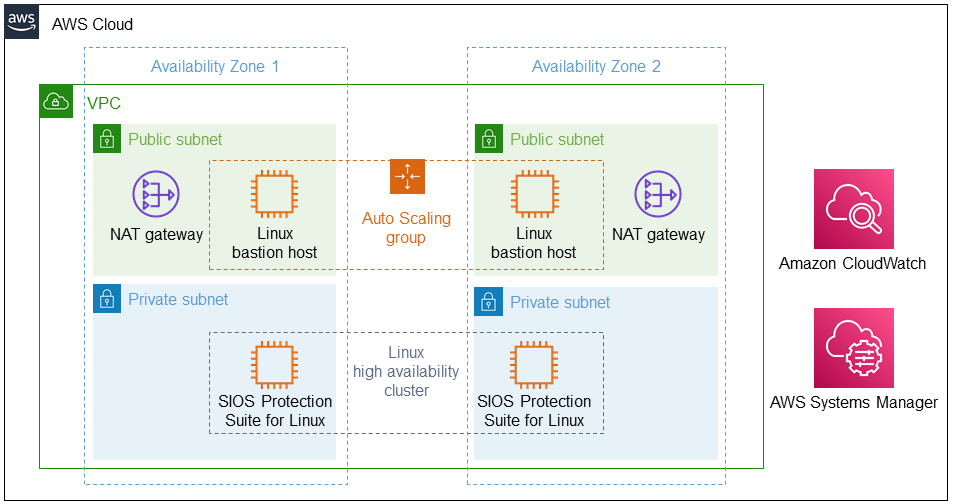

:xrefstyle: short

Deploying this Quick Start for a new virtual private cloud (VPC) with
default parameters builds the following {partner-product-short-name} environment in the
AWS Cloud.

// Replace this example diagram with your own. Follow our wiki guidelines: https://w.amazon.com/bin/view/AWS_Quick_Starts/Process_for_PSAs/#HPrepareyourarchitecturediagram. Upload your source PowerPoint file to the GitHub {deployment name}/docs/images/ directory in this repo. 

[#architecture1]
.Quick Start architecture for {partner-product-short-name} on AWS

As shown in <<architecture1>>, the Quick Start sets up the following:

* A highly available architecture that spans two Availability Zones.*
* A VPC configured with public and private subnets, according to AWS best practices, to provide you with your own virtual network on AWS.*
* In the public subnets:
** Managed network address translation (NAT) gateways to allow outbound internet access for resources in the private subnets.*
** Linux bastion hosts in an Amazon Elastic Compute Cloud (Amazon EC2) Auto Scaling group to allow inbound SSH (Secure Shell) access to Amazon EC2 instances in public and private subnets.*
* In the private subnets, two cluster nodes featuring SIOS Protection Suite for Linux.
* Amazon CloudWatch log groups to monitor, store, and access log files from EC2 instances.
* AWS Systems Manager runbook to automate the deployment.

[.small]#* The template that deploys the Quick Start into an existing VPC skips the components marked by asterisks and prompts you for your existing VPC configuration.#

|===
|Component |Details

// Space needed to maintain table headers
|VPC |Single AWS Region with two Availability Zones.
|Instance type |Minimum recommended instance type: t2.medium.
|Operating system |See the http://docs.us.sios.com/Linux/9.2.2/LK4L/SupportMatrix/index.htm[SIOS Protection Suite for Linux Support Matrix].
|Elastic IP |One Elastic IP address connected to each bastion host instance.
|Instances |Two instances: two SIOS Protection Suite for Linux cluster nodes.
|Volumes |Two volumes (gp2 or io3) per cluster node: one home volume (/) and one additional volume for replicated data storage.
|===